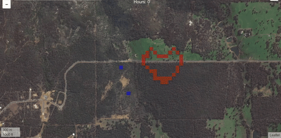

# About

A bushfire risk simulation using satellite images, you can try it:
- [https://the-winter.github.io/spaceapps2017_matches](https://the-winter.github.io/spaceapps2017_matches).



# Authors

A [NASA Spaceapp2017](https://2017.spaceappschallenge.org/) project made by [Jaycob](https://github.com/JaycobC), [the-winter](https://github.com/the-winter), [Mike](https://github.com/wassname), and [Nicola](https://github.com/nicolaruprecht) in Perth (team [Matches)](https://2017.spaceappschallenge.org/challenges/warning-danger-ahead/and-you-can-help-fight-fires/teams/matches/stream).

## Problem

Bush fires cause pervasive harm to our communities - they result in damage to wildlife, property, our economy, and worst of all loss of life.

## Solution

Our application simulates bush fires using real data about the environment to identify preventative actions and ensure the safety of our communities.

## Approach

This challenge implied creating a real-time fire response tool but instead we approached this problem as a prevention and minimisation problem. That is, a harm reduction solution which directly responds to the United Nations goal. This is because it is more effective to prevent and minimise harm than to response to it once it has already started. So we built a prototype that can identify how to better prepare for bush fires. At the moment there is no statistical feedback to inform communities if they have done enough to prevent the spread of bush fires. But now you can use our application to to verify the fire safety of any specific location using environmental data from NASA. By running our simulation and identifying preventative measures to take, communities are enabled to better prepare and reduce the harm that bush fires unveil, including economic, environmental and human losses.

## Impact

Our bush fire simulation tool will identify preventative actions that will result in reduced harm to the community. This impact of this app is particularly relevant to regional Australia where vulnerable farmers, property owners and national parks need to regularly burn off excess plant matter to prevent the spread of fires. Using our app, users can clearly identify if their regular burn off is enough to suppress a fire without having to wait for the dangers of a real fire to test it. And then users can incorporate this feedback into the real world to minimise fire damage to their property and to the community.

## Future Development

In the future we want to add the capability for users to register burn offs which would notify emergency services for monitoring. They could also register the completion of the burn off along with feedback about the environment that might be useful for emergency services. We’d also like to incorporate more information about the local emergency services response to better simulate how the fire might play out. Furthermore, NASA’s thermal sensors are only accurate to 375 metres. Having users register the location of the burn off could enable NASA to increase the accuracy of the sensors. We would also want to incorporate more advanced environmental data from NASA to increase the accuracy of our simulation.
Our vision for future UI and feature development is shown here.

# Instructions

- Click to light a fire
- click the fireman button to add firemen
- press start to step the simulation

# How it works

The fire burns fuel (f) which is taken from an estimate of vegetation. This is provided by [an EVI index](https://explorer.earthengine.google.com/#detail/LANDSAT%2FLC8_L1T_ANNUAL_EVI) derived from NASA's Landsat-8 images. Fire spreads uphill easily but struggles to spread downhill so we take into account elevation by using [30m resolution SRTM Digital elevation data](https://explorer.earthengine.google.com/#detail/USGS%2FSRTMGL1_003).

The equation which describes the fires chance to ignite a nearby tile is adapted from [Noble et al 1980](https://www.researchgate.net/publication/229624147_McArthur's_fire-danger_meters_expressed_as_equations).

```
T = I * W^2 * exp(0.069 *atan(dh/w)) * (FDI + 0.024 * V * cos(theta))
 ~= I * W^2 * exp(0.069 *dh/w) * (FDI + 0.024 * V * cos(theta))
```

Where I is fire intensity, W is fuel weight, dh is the difference in height between tiles, w is the distance between tiles, V is wind velocity and theta describes the wind direction. FDI is the fire danger index which covers drought factor, temperature, and humidity. We use the small tan approximation to simplify the equation.

*Note that wind direction and velocity are not implemented yet.*
